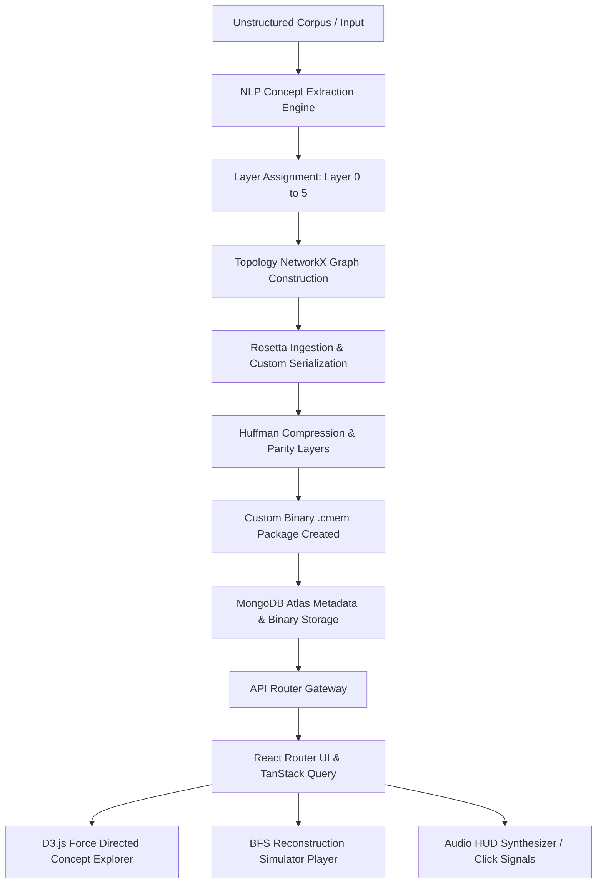

# ARKIVE // Civilization Memory Operating System (M_OS)

[](https://opensource.org/licenses/MIT)
[](https://fastapi.tiangolo.com/)
[](https://react.dev/)
[](https://www.mongodb.com/atlas)

> **"Every civilization that has ever collapsed has taken its knowledge with it. The internet is physical. It runs on grids, copper, and social stability. It has no survival protocol. We built one."**

ARKIVE is a conceptual, end-to-end full-stack platform designed to preserve and reconstruct human scientific and logical knowledge in the event of an existential grid collapse. It operates under a stark "stark-void" aesthetic, acting as a vault that ingests unstructured texts, extracts logical concept nodes, computes a **Survival Score**, and packages them into a custom binary format (`.cmem`) featuring a built-in "Rosetta Stone" header.

---

## 📐 System Architecture

ARKIVE is structured as a decoupled Full-Stack Web Application. The following diagram illustrates the flow from data ingestion to binary packaging, storage, and interactive graph reconstruction:



---

## 💾 Custom Binary Format (`.cmem`) Specification

To ensure knowledge is reconstructible without complex compilers, operating systems, or heavy runtimes, ARKIVE compiles all text data, graphs, and schemas into a custom **Civilization Memory binary format** (`.cmem`).

```
+--------------------------------------------------------+
|                      MAGIC BYTES                       |  -> 4 Bytes ("CMEM")
+--------------------------------------------------------+
|                METADATA BLOCK LENGTH                   |  -> 4 Bytes (uint32)
+--------------------------------------------------------+
|                METADATA JSON PAYLOAD                   |  -> JSON representation of concepts,
| (Title, Author, Nodes, Dependencies, Survival Index)   |     edges, and Huffman dictionary
+--------------------------------------------------------+
|                 HUFFMAN TREE SYMBOLS                   |  -> Serialized tree structures and frequency table
+--------------------------------------------------------+
|                 COMPRESSED DATA BLOCK                  |  -> Huffman + LZ77 compressed bitstream
+--------------------------------------------------------+
|                  PARITY & REDUNDANCY                   |  -> Reed-Solomon style parity padding
+--------------------------------------------------------+
```

### 🔑 Key Encoding Features:
1. **Self-Describing Huffman Dictionary**: The `.cmem` binary bundles its own symbol mapping directly inside the header, meaning future decoders do not require external libraries or predefined tables to decode the content.
2. **Layered Redundancy Blocks**: If sections of the physical media storage corrupt, the duplicate symbol nodes in the parity segments allow the reconstruction engine to resolve corrupted bytes.
3. **Hardware Agnostic Flags**: Includes parameters that denote whether the knowledge requires specific physical substrates (e.g., silicon, optics) or can be bootstrapped purely using mechanical/logical components.

---

## 🧮 Backend Algorithms

### 1. Concept Extraction & Layer Assignment (spaCy)
Unstructured text inputs are parsed via Natural Language Processing. The engine extracts mathematical equations, key terms, constants (e.g., $c$, $G$, $h$), and scientific formulas. It classifies them into six layers:
- **Layer 0 (Foundations)**: Mathematical and logical primitives (e.g., arithmetic, set theory, binary logic).
- **Layer 1 (Physics & Mechanics)**: Fundamental equations (e.g., $F=ma$, gravity, thermodynamics).
- **Layer 2 (Chemistry & Elements)**: Materials, basic periodic elements, atomic structure.
- **Layer 3 (Biology & Medicine)**: Cellular structures, hygiene, antibiotics, agriculture.
- **Layer 4 (Engineering & Infrastructure)**: Motors, grids, circuits, basic metallurgy.
- **Layer 5 (Advanced Application)**: Computation, networking, aerospace, advanced logic.

### 2. Survival Index Scoring
The **Survival Score** computes the longevity of a compiled block based on multiple parameters:
$$\text{Survival Score (Years)} = (\text{Base Score} \times \text{Redundancy Multiplier}) + (\text{Anchors Count} \times 15) - (\text{Size Penalty})$$
- **Base Score**: 100 years.
- **Redundancy Multiplier**: Scales up to $3.0\times$ based on the selected redundancy index (1 to 5).
- **Math Anchors**: Adding Layer 0 concepts increases the score by 15 years per anchor since foundational math is easier to bootstrap without prior tools.
- **Size Penalty**: Massive unorganized corpora lower readability scores, reducing the overall survival index.

### 3. Reconstruction BFS Graph Traversal
The Simulator Page runs a step-by-step reconstruction. Instead of an arbitrary order, it performs a **Breadth-First Search (BFS)** traversal on the Directed Acyclic Graph (DAG) starting strictly at **Layer 0** (Mathematical Foundations). A concept cannot be unlocked until all of its dependency parents have been reconstructed by the simulated civilization.

---

## 🛠️ Tech Stack & Dependencies

### Backend
- **FastAPI**: Asynchronous Python web framework for lightweight routing.
- **Uvicorn**: High-performance ASGI server.
- **PyMongo / Motor**: Asynchronous driver for database connectivity.
- **MongoDB Atlas**: Document-based cloud database storing archive models and binary records.
- **spaCy**: Advanced NLP library for concept, formula, and constant extraction.
- **NetworkX**: Rich Python library for creating and analyzing directed dependency graphs.
- **NLTK & BeautifulSoup**: Used for secondary token cleaning and web page extraction.

### Frontend
- **React**: Component-driven SPA framework.
- **Vite**: Ultra-fast frontend bundler.
- **Tailwind CSS v4**: Modern CSS compiler incorporating modular design tokens.
- **Framer Motion**: Smooth entry, exit, and hover animations.
- **D3.js**: Custom force-directed simulation mapping concept nodes and edge links.
- **Lucide React**: Clean SVG vector icons for HUD dashboards.
- **HTML5 Web Audio API**: Used to generate synthesis retro click-chime clicks during HUD interactions.

---

## ⚙️ Installation & Setup

### Prerequisites
- Python 3.10 or higher
- Node.js 18 or higher
- A running MongoDB Atlas instance or local MongoDB server

### 1. Backend Setup
1. Navigate to the backend directory:
   ```bash
   cd backend
   ```
2. Create and activate a virtual environment:
   ```bash
   python -m venv venv
   # Windows:
   .\venv\Scripts\activate
   # Linux/macOS:
   source venv/bin/activate
   ```
3. Install dependencies:
   ```bash
   pip install -r requirements.txt
   ```
4. Download the spaCy medium English language model:
   ```bash
   python -m spacy download en_core_web_md
   ```
5. Set up environment variables. Create a `.env` file in the `backend/` directory:
   ```env
   MONGODB_URI=mongodb+srv://<username>:<password>@cluster0.mongodb.net/arkive?retryWrites=true&w=majority
   DB_NAME=arkive
   ```
6. Seed the base concepts (Layer 0–2 definitions):
   ```bash
   python -m backend.db.seed_data
   ```
7. Start the FastAPI API server:
   ```bash
   python -m uvicorn backend.main:app --port 8000 --reload
   ```

### 2. Frontend Setup
1. Navigate to the frontend directory:
   ```bash
   cd ../frontend
   ```
2. Install dependencies:
   ```bash
   npm install
   ```
3. Launch the development server:
   ```bash
   npm run dev
   ```
4. Open your browser and navigate to `http://localhost:5173/`.

---

## 📡 API Reference

### **Encoder Router** (`/api/encoder`)
- `POST /extract-concepts`: Analyzes input text corpus and returns a flat list of potential concept entities and parameters.
- `POST /generate-archive`: Compiles selected concept models, structures the Huffman Tree, generates `.cmem` bytes, commits the record to MongoDB Atlas, and returns a binary stream.

### **Archive Router** (`/api/archive`)
- `GET /`: Lists all compiled archives with metadata summaries.
- `GET /{id}`: Returns detailed parameters, graph node listings, and survival scores for a specific archive.
- `GET /{id}/download`: Streams the raw `.cmem` binary file for local storage.
- `DELETE /{id}`: Deletes the archive record from the registry.

### **Graph Router** (`/api/graph`)
- `GET /`: Retreives the global system topology (comprising seeded concepts and relationships).

### **Simulator Router** (`/api/simulator`)
- `GET /steps`: Generates the step-by-step breadths-first traversal path for reconstructive simulation.

---

## 🎨 Cosmic Design System Tokens

ARKIVE incorporates a customized CSS theme structured inside Tailwind v4. The color codes match a retro-futuristic cosmic terminal:

- `void`: `#0a0a0f` (deepest outer space background)
- `cosmos`: `#0f1117` (primary panels and surfaces)
- `nebula`: `#1a1d2e` (elevated cards and button containers)
- `aurora`: `#2d3561` (thin HUD borders and borders)
- `signal`: `#4f8ef7` (neon action blue)
- `pulse`: `#7b5ea7` (cosmic accent purple)
- `glow`: `#43d9ad` (success feedback green)
- `warn`: `#f0a500` (hud warn amber)

---

## 📜 License
This project is licensed under the MIT License. Feel free to clone, edit, and build upon this survival blueprint.

**ARKIVE Platform M_OS // Secure Your Knowledge for the Future.**
